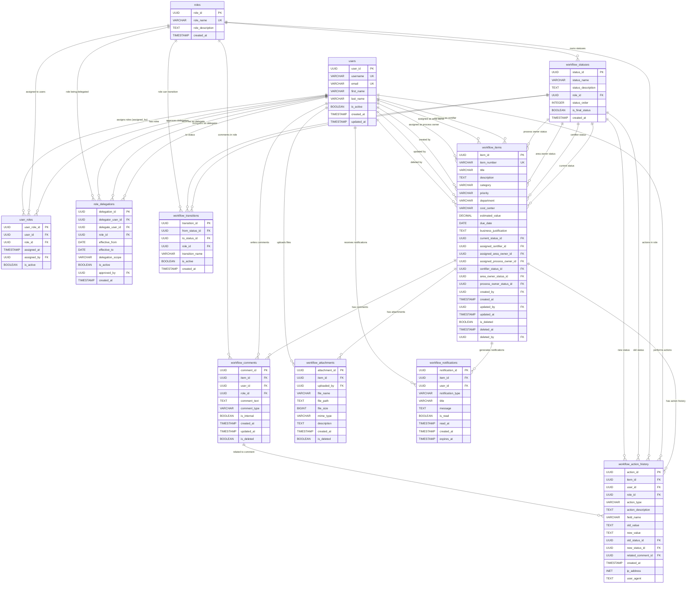

# Entity Relationship Diagram - Workflow Management System

## Overview
This document provides a comprehensive Entity Relationship Diagram for the workflow management system supporting three personas: Certifier, Area Owner, and Process Owner with delegation capabilities.

## Mermaid ER Diagram



## ASCII ER Diagram

```
                    WORKFLOW MANAGEMENT SYSTEM - ENTITY RELATIONSHIP DIAGRAM
                    ================================================================

    ┌─────────────────────────────────────────────────────────────────────────────────────────────────┐
    │                                   USER & ROLE MANAGEMENT                                        │
    └─────────────────────────────────────────────────────────────────────────────────────────────────┘

    ┌─────────────────┐         ┌─────────────────┐         ┌─────────────────┐
    │     USERS       │         │   USER_ROLES    │         │     ROLES       │
    ├─────────────────┤         ├─────────────────┤         ├─────────────────┤
    │ user_id (PK)    │◄────────┤ user_id (FK)    │────────►│ role_id (PK)    │
    │ username (UK)   │         │ role_id (FK)    │         │ role_name (UK)  │
    │ email (UK)      │         │ assigned_by(FK) │         │ role_description│
    │ first_name      │         │ assigned_at     │         │ created_at      │
    │ last_name       │         │ is_active       │         └─────────────────┘
    │ is_active       │         └─────────────────┘
    │ created_at      │                 │
    │ updated_at      │                 │ assigned_by
    └─────────────────┘                 │
            │                           │
            └───────────────────────────┘

    ┌─────────────────────────────────────────────────────────────────────────────────────────────────┐
    │                                   DELEGATION SYSTEM                                             │
    └─────────────────────────────────────────────────────────────────────────────────────────────────┘

    ┌─────────────────┐         ┌─────────────────────────┐
    │     USERS       │         │   ROLE_DELEGATIONS      │
    ├─────────────────┤         ├─────────────────────────┤
    │ user_id (PK)    │◄────────┤ delegator_user_id (FK)  │
    │ ...             │         │ delegate_user_id (FK)   │◄────┐
    └─────────────────┘         │ role_id (FK)            │     │
            │                   │ effective_from          │     │
            │                   │ effective_to            │     │
            │                   │ delegation_scope        │     │
            │                   │ is_active               │     │
            │                   │ approved_by (FK)        │     │
            │                   │ created_at              │     │
            │                   └─────────────────────────┘     │
            │                           │                       │
            └───────────────────────────┘                       │
                                        │                       │
                    ┌─────────────────────────────────────────────┘
                    │
                    ▼
            ┌─────────────────┐
            │     ROLES       │
            ├─────────────────┤
            │ role_id (PK)    │
            │ role_name       │
            │ ...             │
            └─────────────────┘

    ┌─────────────────────────────────────────────────────────────────────────────────────────────────┐
    │                               WORKFLOW CONFIGURATION                                            │
    └─────────────────────────────────────────────────────────────────────────────────────────────────┘

    ┌─────────────────────┐         ┌─────────────────────────┐         ┌─────────────────┐
    │ WORKFLOW_STATUSES   │         │ WORKFLOW_TRANSITIONS    │         │     ROLES       │
    ├─────────────────────┤         ├─────────────────────────┤         ├─────────────────┤
    │ status_id (PK)      │◄────────┤ from_status_id (FK)     │         │ role_id (PK)    │
    │ status_name         │         │ to_status_id (FK)       │────────►│ role_name       │
    │ status_description  │         │ role_id (FK)            │         │ ...             │
    │ role_id (FK)        │────────►│ transition_name         │         └─────────────────┘
    │ status_order        │         │ is_active               │
    │ is_final_status     │         │ created_at              │
    │ created_at          │         └─────────────────────────┘
    └─────────────────────┘                 │
            │                               │
            └───────────────────────────────┘
                      to_status_id

    ┌─────────────────────────────────────────────────────────────────────────────────────────────────┐
    │                                 MAIN WORKFLOW ITEMS                                             │
    └─────────────────────────────────────────────────────────────────────────────────────────────────┘

    ┌─────────────────────────────────────────────────────────────────────────────────────────────────┐
    │                                   WORKFLOW_ITEMS                                               │
    ├─────────────────────────────────────────────────────────────────────────────────────────────────┤
    │ item_id (PK)                    │ current_status_id (FK) ──────────┐                            │
    │                                 │                                   │                            │
    │ ┌─ BUSINESS DATA (10 COLUMNS) ─┐│ assigned_certifier_id (FK) ───────┼────────┐                  │
    │ │ item_number (UK)             ││ assigned_area_owner_id (FK) ──────┼────────┼────────┐         │
    │ │ title                        ││ assigned_process_owner_id (FK) ───┼────────┼────────┼────────┐│
    │ │ description                  ││                                   │        │        │        ││
    │ │ category                     ││ certifier_status_id (FK) ─────────┼────────┼────────┼────────┼┤
    │ │ priority                     ││ area_owner_status_id (FK) ────────┼────────┼────────┼────────┼┤
    │ │ department                   ││ process_owner_status_id (FK) ─────┼────────┼────────┼────────┼┤
    │ │ cost_center                  ││                                   │        │        │        ││
    │ │ estimated_value              ││ created_by (FK) ──────────────────┼────────┼────────┼────────┼┤
    │ │ due_date                     ││ updated_by (FK) ──────────────────┼────────┼────────┼────────┼┤
    │ │ business_justification       ││ deleted_by (FK) ──────────────────┼────────┼────────┼────────┼┤
    │ └─────────────────────────────┘│                                   │        │        │        ││
    │                                 │ created_at, updated_at, deleted_at│        │        │        ││
    │                                 │ is_deleted                        │        │        │        ││
    └─────────────────────────────────────────────────────────────────────┼────────┼────────┼────────┼┘
                                                                          │        │        │        │
                                                                          ▼        ▼        ▼        ▼
                                                            ┌─────────────────────────────────────────────┐
                                                            │              USERS                          │
                                                            ├─────────────────────────────────────────────┤
                                                            │ user_id (PK)                                │
                                                            │ username, email, first_name, last_name     │
                                                            │ is_active, created_at, updated_at          │
                                                            └─────────────────────────────────────────────┘
                                                                          │
                                                                          ▼
                                                            ┌─────────────────────────────────────────────┐
                                                            │         WORKFLOW_STATUSES                   │
                                                            ├─────────────────────────────────────────────┤
                                                            │ status_id (PK)                              │
                                                            │ status_name, status_description             │
                                                            │ role_id (FK), status_order                 │
                                                            │ is_final_status, created_at                │
                                                            └─────────────────────────────────────────────┘

    ┌─────────────────────────────────────────────────────────────────────────────────────────────────┐
    │                               TRACKING & AUDIT SYSTEM                                          │
    └─────────────────────────────────────────────────────────────────────────────────────────────────┘

    ┌─────────────────────┐         ┌─────────────────────────┐         ┌─────────────────────┐
    │ WORKFLOW_COMMENTS   │         │ WORKFLOW_ACTION_HISTORY │         │ WORKFLOW_ATTACHMENTS│
    ├─────────────────────┤         ├─────────────────────────┤         ├─────────────────────┤
    │ comment_id (PK)     │         │ action_id (PK)          │         │ attachment_id (PK)  │
    │ item_id (FK)        │────────►│ item_id (FK)            │◄────────│ item_id (FK)        │
    │ user_id (FK)        │         │ user_id (FK)            │         │ uploaded_by (FK)    │
    │ role_id (FK)        │         │ role_id (FK)            │         │ file_name           │
    │ comment_text        │         │ action_type             │         │ file_path           │
    │ comment_type        │         │ action_description      │         │ file_size           │
    │ is_internal         │         │ field_name              │         │ mime_type           │
    │ created_at          │         │ old_value, new_value    │         │ description         │
    │ updated_at          │         │ old_status_id (FK)      │         │ created_at          │
    │ is_deleted          │         │ new_status_id (FK)      │         │ is_deleted          │
    └─────────────────────┘         │ related_comment_id (FK) │         └─────────────────────┘
            │                       │ created_at              │                 │
            │                       │ ip_address, user_agent  │                 │
            │                       └─────────────────────────┘                 │
            │                               │                                   │
            └───────────────────────────────┘                                   │
                    related_comment_id                                          │
                                                                                │
                                    ┌───────────────────────────────────────────┘
                                    │
                                    ▼
                        ┌─────────────────────────┐
                        │ WORKFLOW_NOTIFICATIONS  │
                        ├─────────────────────────┤
                        │ notification_id (PK)    │
                        │ item_id (FK)            │
                        │ user_id (FK)            │
                        │ notification_type       │
                        │ title, message          │
                        │ is_read, read_at        │
                        │ created_at, expires_at  │
                        └─────────────────────────┘

    ┌─────────────────────────────────────────────────────────────────────────────────────────────────┐
    │                                  RELATIONSHIP SUMMARY                                           │
    └─────────────────────────────────────────────────────────────────────────────────────────────────┘

    RELATIONSHIP TYPES:
    ═══════════════════
    ──────► One-to-Many (1:M)
    ◄─────► Many-to-Many (M:M) via junction table
    ┌─────┐ Entity/Table
    (PK)    Primary Key
    (FK)    Foreign Key
    (UK)    Unique Key

    KEY RELATIONSHIPS:
    ═════════════════
    1. Users ◄─────► Roles (M:M via user_roles)
    2. Users ──────► Role_Delegations (1:M as delegator, delegate, approver)
    3. Roles ──────► Workflow_Statuses (1:M)
    4. Workflow_Statuses ──────► Workflow_Items (1:M multiple status fields)
    5. Users ──────► Workflow_Items (1:M multiple assignment fields)
    6. Workflow_Items ──────► Comments/History/Attachments/Notifications (1:M)
```

## Key Relationships Explained

### 1. User and Role Management
- **Users ↔ Roles**: Many-to-many relationship through `user_roles` table
- **Self-referencing**: Users can assign roles to other users (`assigned_by`)
- **Role Hierarchy**: Three main roles (Certifier, Area Owner, Process Owner)

### 2. Delegation System
- **Delegator → Delegate**: Users can delegate their role permissions to other users
- **Time-bound**: Delegations have effective date ranges
- **Scope Control**: Delegations can be scoped to specific items or general
- **Approval Process**: Delegations require approval from authorized users

### 3. Workflow Status Management
- **Role-specific Statuses**: Each role has its own set of workflow statuses
- **Status Transitions**: Controlled transitions between statuses based on roles
- **Multiple Status Tracking**: Each workflow item tracks status for each persona separately

### 4. Main Workflow Items
- **Business Data*
