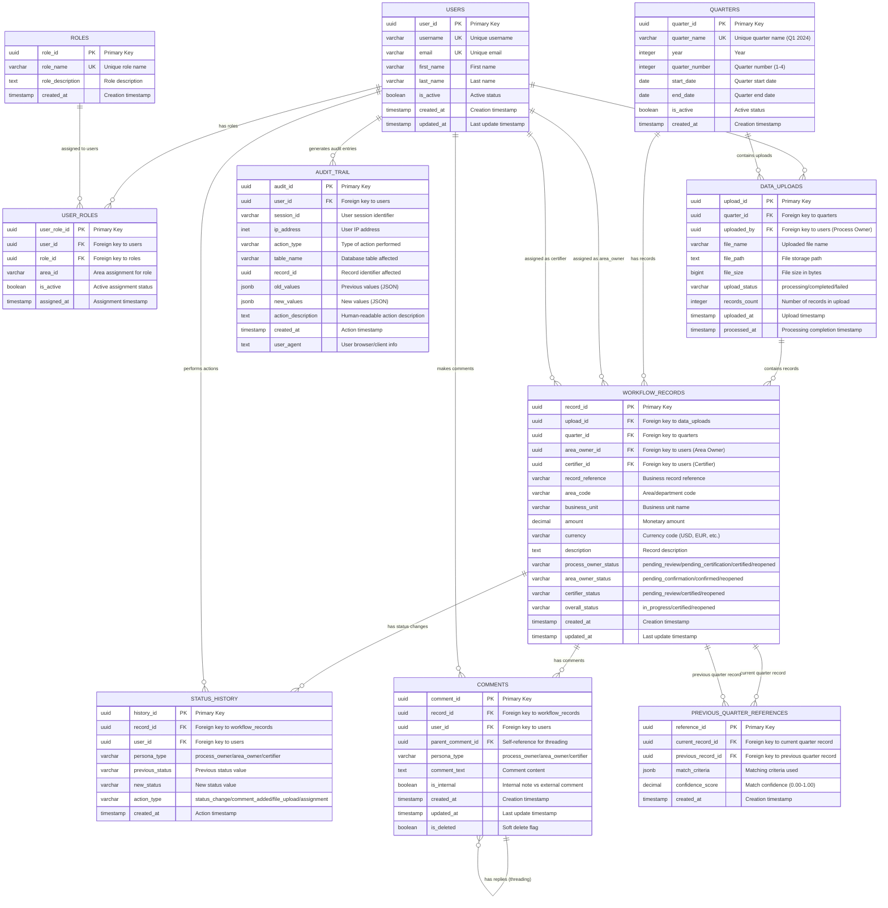
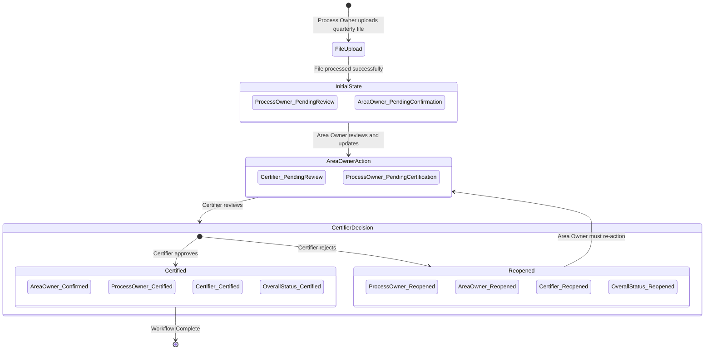

# Workflow Tool Database - Mermaid ER Diagram

## Entity Relationship Diagram (Mermaid Format)



## Workflow State Diagram



## Key Business Rules and Relationships

### 1. **User Role Management**
- **Many-to-Many Relationship**: Users can have multiple roles, roles can be assigned to multiple users
- **Junction Table**: `USER_ROLES` with additional `area_id` for area-specific assignments
- **Role Types**: Process Owner, Area Owner, Certifier

### 2. **Data Flow Hierarchy**
```
QUARTERS → DATA_UPLOADS → WORKFLOW_RECORDS
    ↓           ↓              ↓
USERS ←→ USERS ←→ USERS (Process Owner, Area Owner, Certifier)
```

### 3. **Workflow State Management**
- **Initial State**: All personas get pending statuses after file upload
- **Area Owner Action**: Updates trigger Process Owner status change to "pending_certification"
- **Certifier Decision**: 
  - **Certified**: Process Owner → "certified", workflow complete
  - **Reopened**: Both Process Owner and Area Owner → "reopened", requires re-action

### 4. **Audit Trail Relationships**
- **STATUS_HISTORY**: Tracks all status changes with persona context
- **COMMENTS**: Supports threading with self-referencing relationship
- **AUDIT_TRAIL**: System-wide audit logging for compliance
- **PREVIOUS_QUARTER_REFERENCES**: Links current records to historical data

### 5. **Access Control Patterns**
- **Area Owners**: Filter by `area_owner_id` and `area_code`
- **Certifiers**: Filter by `certifier_id` 
- **Process Owners**: Access all records for quarters they uploaded

### 6. **Historical Data Linking**
- **Self-Referencing**: `PREVIOUS_QUARTER_REFERENCES` links current and previous quarter records
- **Confidence Scoring**: Match quality assessment for automatic linking
- **JSON Criteria**: Flexible matching rules stored as JSONB

### 7. **Comment Threading**
- **Self-Referencing**: `parent_comment_id` enables reply chains
- **Persona Context**: Comments tagged by persona type for proper attribution
- **Soft Deletion**: `is_deleted` flag for audit trail preservation

This Mermaid ER diagram provides a comprehensive view of the workflow tool database with clear entity relationships, proper foreign key constraints, and complete audit trail capabilities suitable for ServiceNow-style workflow management.
